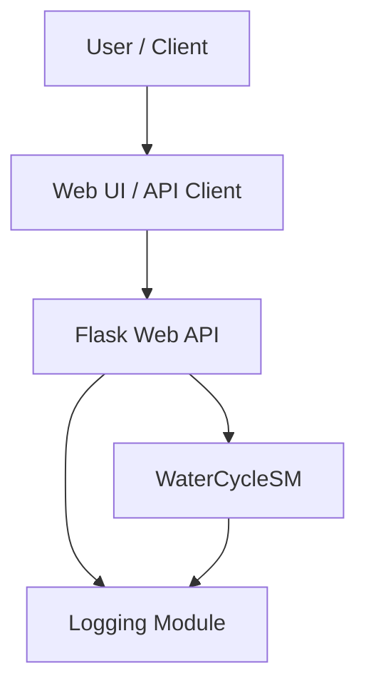

# Water Cycle Project: High-Level Design (HLD)

---

## System Objectives and Requirements

- **Objective:**  
  Simulate water state transitions (solid, liquid, gaseous) based on temperature, using a state machine pattern, with a web interface for interaction and visualization.

- **Functional Requirements:**  
  - Model water's three states and transitions (`heat_up`, `cool_down`).
  - Provide RESTful API endpoints for state queries and transitions.
  - Log all state transitions and user interactions.

- **Non-Functional Requirements:**  
  - Fast and reliable state transitions.
  - Clear, maintainable codebase.
  - Scalable for future state/transition expansions.
  - Secure and robust web interface.

---

## Core Component Identification

- **WaterCycleSM:**  
  State machine for water states and transitions.

- **Flask Web API:**  
  RESTful endpoints for client interaction.

- **Logging Module:**  
  Tracks transitions and events.

- **Frontend (optional):**  
  Simple UI for demonstration (could use Flask templates or JS frontend).

---

## System Architecture Diagram

---

## Data Flow Mapping

- User sends API request (e.g., `POST /heat_up`).
- Flask endpoint receives and validates request.
- Flask invokes `WaterCycleSM` transition.
- `WaterCycleSM` updates state, triggers callbacks.
- Logging module records transition.
- Flask returns new state in API response.

---

## API Design

| Endpoint         | Method | Description                         | Request Body      | Response             |
|------------------|--------|-------------------------------------|-------------------|----------------------|
| `/state`         | GET    | Get current water state             | None              | `{state: "liquid"}`  |
| `/heat_up`       | POST   | Transition to higher-energy state   | None              | `{state: "gas"}`     |
| `/cool_down`     | POST   | Transition to lower-energy state    | None              | `{state: "solid"}`   |
| `/history`       | GET    | Get state transition history        | None              | `[{from, to, time}]` |

---

## Non-Functional Considerations

- **Performance:** Lightweight state transitions, low latency API.
- **Security:** Input validation, safe HTTP methods.
- **Reliability:** Graceful error handling, logging.
- **Scalability:** Modular design for adding more states/transitions.
- **Maintainability:** Clear separation of concerns, docstrings, logging.

---

## Technology Selection Justification

- **Python:** Rapid prototyping, strong ecosystem.
- **transitions library:** Clean, declarative state machine implementation.
- **Flask:** Lightweight, easy-to-use web framework.
- **Python logging:** Standardized, configurable event tracking.

---

## Deployment Strategy

- Containerized via Docker (recommended).
- Deploy on cloud VM or PaaS (e.g., Heroku, AWS).
- Use Gunicorn for production WSGI serving.
- Environment variables for configuration.
