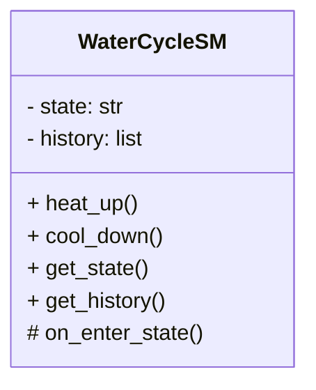
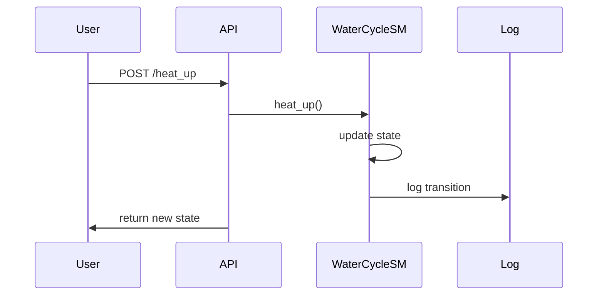
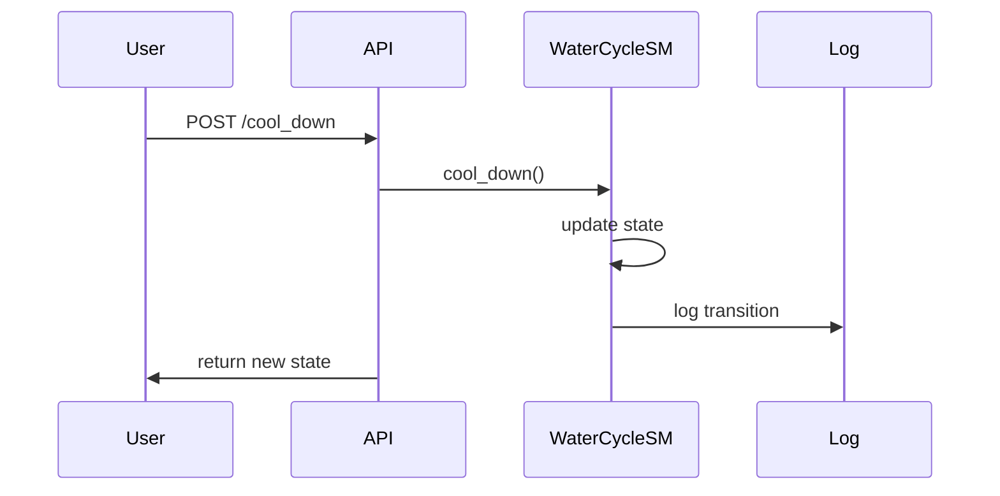

# Water Cycle Project: Low-Level Design (LLD)

---

## WaterCycleSM Class Structure

---

## State Transition Logic

- **States:** `solid` → `liquid` → `gas`
- **Events:**  
  - `heat_up`: solid→liquid, liquid→gas  
  - `cool_down`: gas→liquid, liquid→solid

---

## Method Specifications

| Method         | Description                                      |
|----------------|--------------------------------------------------|
| `heat_up()`    | Move to next higher state, if possible           |
| `cool_down()`  | Move to next lower state, if possible            |
| `get_state()`  | Return current state                             |
| `get_history()`| Return list of past transitions                  |
| `on_enter_state()` | Callback on state change, logs event         |

---

## Callback Implementations

- **on_enter_state:**  
  - Triggered after each transition.
  - Logs transition (from, to, timestamp).
  - Updates history.

---

## Logging Mechanism

- Uses Python's `logging` module.
- Logs:
  - State transitions (from, to, time).
  - API calls and errors.
- Configurable log level (INFO/DEBUG).

---

## Class Diagram

(see above Mermaid diagram)

---

## Sequence Diagram: `heat_up` Operation

---

## Sequence Diagram: `cool_down` Operation

---
